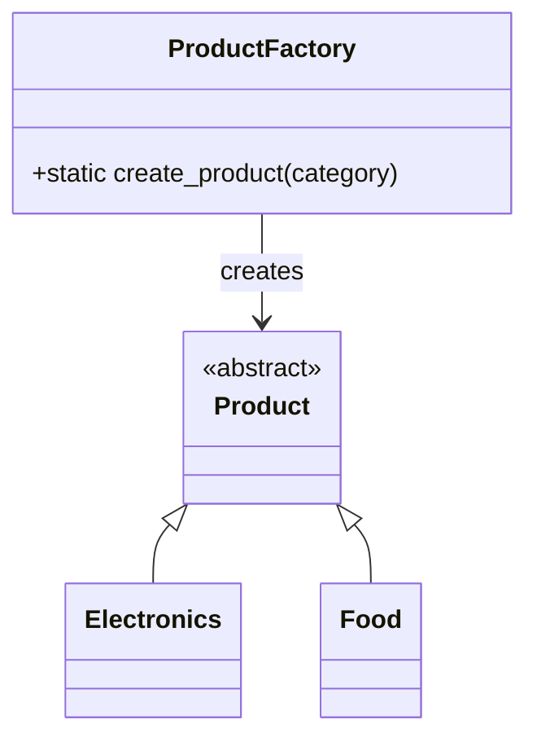

Faz 1: Creational (Yaratımsal) Örüntüler
1. Factory Method
Nerede Kullanıldı: src/cart.py içerisindeki ProductFactory sınıfı ve Cart.add_item metodu içerisinde kullanıldı.  
Neden Kullanıldı: Faz 0'da sepet sınıfı (Cart), hangi ürünün nasıl yaratılacağını (if-else bloklarıyla) kendisi biliyordu. Bu durum "God Class" sorununa ve esneklik kaybına yol açıyordu. Nesne yaratma sorumluluğunu sepetten ayırmak için bu örüntü seçildi. 
 Ne Kazandım:Loose Coupling (Gevşek Bağlılık): Sepet artık somut ürün sınıflarına (Electronics, Food) doğrudan bağımlı değil.  
  OCP Desteği: Yeni bir ürün kategorisi eklemek için sepetin kodunu değiştirmeye gerek kalmadı; sadece fabrikaya yeni bir seçenek eklemek yeterli.  
  Single Responsibility: Sepet sadece ürünleri listelemeye, fabrika ise sadece ürünleri üretmeye odaklandı.
FAZ 0

   
FAZ 1
```mermaid
   classDiagram
    class ProductFactory {
        +create_product(category, name, price) Product$
    }
    
    class Product {
        <<abstract>>
        +name: str
        +price: float
        +get_details()*
    }
    
    class Electronics {
        +get_details()
    }
    
    class Food {
        +get_details()
    }

    ProductFactory ..> Product : "creates"
    Product <|-- Electronics
    Product <|-- Food

    note for ProductFactory "Nesne yaratma sorumluluğu\nburada merkezileştirilmiştir."
   ```


Faz 2:
2. Decorator (Faz 2)
Nerede Kullanıldı: GiftWrapDecorator ve WarrantyDecorator sınıflarında.
Neden Kullanıldı: Ürün sınıflarını (Electronics vb.) kalıtımla şişirmek yerine, çalışma anında (runtime) dinamik özellik eklemek için.
Ne Kazandım:Esneklik sağlandı; bir ürün hem garantili hem hediye paketli olabiliyor.
3. Adapter (Faz 2)
Nerede Kullanıldı: BankPaymentAdapter sınıfında.
Neden Kullanıldı: Kuruş bazlı çalışan dış bir banka kütüphanesini, TL bazlı çalışan sepetimize bağlamak için.
Ne Kazandım: Dış sisteme dokunmadan entegrasyon sağlandı.
FAZ 2:
```mermaid
classDiagram
    class Product {
        <<abstract>>
        +name: str
        +price: float
        +get_details()*
    }

    class ProductDecorator {
        <<abstract>>
        -wrapped_product: Product
        +price: float
    }

    class WarrantyDecorator {
        +price: float
    }

    class GiftWrapDecorator {
        +price: float
    }

    class PaymentProcessor {
        <<interface>>
        +process_payment(amount)*
    }

    class BankPaymentAdapter {
        -api: ExternalBankAPI
        +process_payment(amount)
    }

    class ExternalBankAPI {
        +make_payment(cents: int)
    }

    %% Kalıtım ve Sarmalama (Decorator)
    Product <|-- Electronics
    Product <|-- Food
    Product <|-- ProductDecorator
    ProductDecorator <|-- WarrantyDecorator
    ProductDecorator <|-- GiftWrapDecorator
    ProductDecorator o-- Product : "wraps"

    %% Adaptasyon (Adapter)
    PaymentProcessor <|-- BankPaymentAdapter
    BankPaymentAdapter --> ExternalBankAPI : "adapts"

    note for ProductDecorator "Çalışma anında dinamik\nözellik ekleme yapısı"
    note for BankPaymentAdapter "TL formatını Banka API'si için\nKuruş formatına dönüştürür"
```


Faz 3:
4. Strategy (Faz 3)
Nerede Kullanıldı: DiscountStrategy arayüzü ve buna bağlı PercentageDiscount, NoDiscount sınıflarında.
Neden Kullanıldı: Sepet içindeki karmaşık if-else indirim mantığını temizlemek ve Açık/Kapalı Prensibi'ni (OCP) uygulamak için.
Ne Kazandım: Yeni bir indirim türü eklemek için sepetin ana koduna dokunmaya gerek kalmadı; sistem yeni özelliklere "açık", değişime "kapalı" hale geldi.
5. Observer (Faz 3)
Nerede Kullanıldı: Observer soyut sınıfı ile StockManager ve MarketingSystem sınıflarında.
Neden Kullanıldı: Sepete ürün eklendiğinde, sepetin diğer sistemlerle (stok, pazarlama) sıkı bağ kurmadan onları haberdar etmesini sağlamak için.
Ne Kazandım: Sistemler arası bağımlılık (coupling) azaldı. Sepet sınıfı, hangi sistemin onu dinlediğini bilmek zorunda kalmadan bildirim yapabilir hale geldi.


